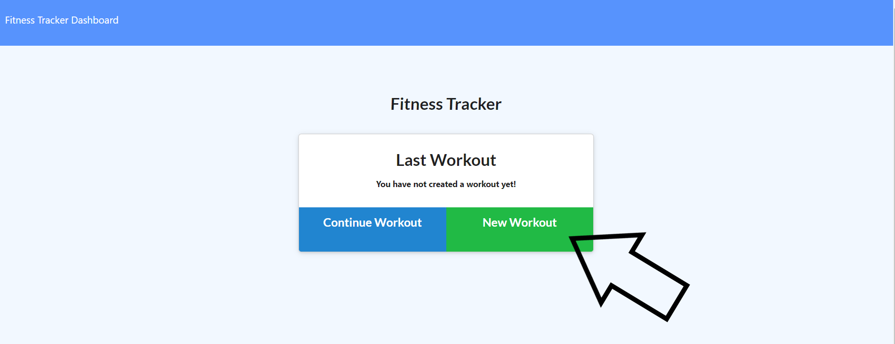
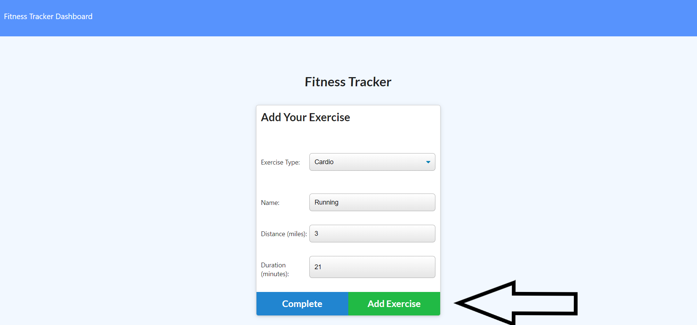
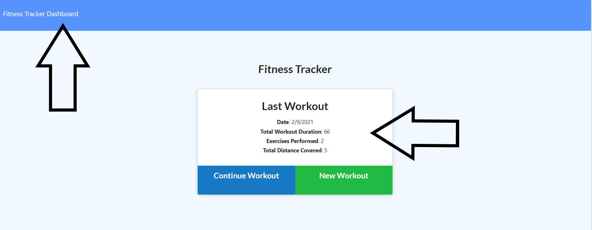
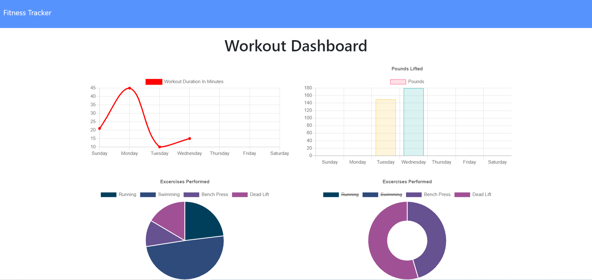

# Fitness-Tracker

## Overview:
This app lets you keep track of your physical activities.  This is done by saving workout documents to a mongo database.  The documents have their data structured with the help of mongoose models.  This was primarily accomplished with Javascript, Mongo, and Mongoose.  

### Table of Contents:
1. [How it works](#How-it-works)
2. [Example](#Example)
3. [Installation](#Installation)
4. [Contributing](#Contributing)
5. [Questions](#Questions)
6. [License](#License)

### How it works!
Upon the apps opening, the user is shown the last workout that was added to the database.  the user than can either choose to create a new workout or add exercises to an existing workout.  After the user is finished building their workout they will be directed back to the main page which will now display their new workout.  From here the user is able to visit the dashboard.  On the dashboard the user can see a collection of all their workouts displayed via pie charts and bar graphs.  

Create a New Workout      Add Exercises      Click on Dashboard       View Dashboard      

### Example
Here is a link to the Fitness-Tracker:  [https://vfavorito-fitness-tracker.herokuapp.com/](https://vfavorito-fitness-tracker.herokuapp.com/)

### Installation
After Cloning the repo to your local machine installation of mongo is required to set up a database.  Once the database is created link it to the app.  Lastly run the command npm i to install package files.  

### Contributing
If you would like to contribute to the development of this app the guidelines for doing so can be found here: [Contribution Covenant](https://www.contributor-covenant.org/version/2/0/code_of_conduct/code_of_conduct.txt)

### Questions?
Visit my Github profile here: [vfavorito](https://github.com/vfavorito) 
If you have any questions you can reach out to me at vince.favorito@gmail.com

### License
This App is covered under the MIT License